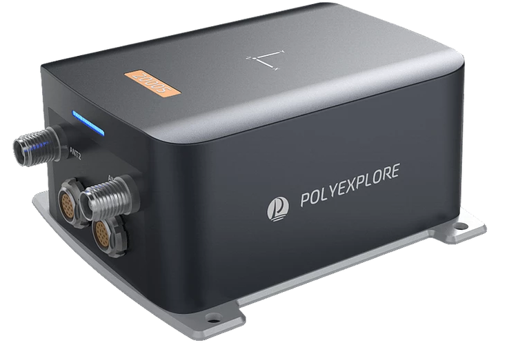

<!-- PROJECT LOGO -->
<br />


  <h3 align="center">ROS Driver</h3>

  <p align="center">
    PolyExplore, Inc.
    <br />
    <a href="https://www.polyexplore.com/"><strong>Visit Our Website</strong></a>
  </p>
  <p align="center">
  <a href="https://github.com/othneildrew/Best-README-Template">
    
  </a>
</p>


<!-- TABLE OF CONTENTS -->
<details open="open">
  <summary>Table of Contents</summary>
  <ol>
    <li>
      <a href="#installation">Installation</a>
      <!-- <ul>
        <li><a href="#built-with">Built With</a></li>
      </ul> -->
    </li>
    <li><a href="#ethernet-output">Ethernet Output</a></li>
    <li><a href="#local-map-origin">Local Map Origin</a></li>
    <li><a href="#imu-data">IMU Data</a></li>
    <li><a href="#geoid-height">Geoid Height</a></li>
    <li><a href="#contact">Contact</a></li>
  </ol>
</details>

<p align="center">
    
</p>

## Build
1. Copy ROS driver source code folder polyx_nodea to catkin_ws/src/.
2. Open the terminal and go under catkin_ws, then type the following commands to build ROS
driver:
```
catkin_make
```

## Serial Port Output
1. To start ROS in background, open a terminal and type "roscore"
2. Open second terminal to run the ROS talker and type the following commands:
```
cd catkin_ws
source devel/setup.bash
cd src/polyx_nodea
./polyx_nodea.sh
```
3. (Optional) Open third terminal to run the ROS listener and type the following commands:
```
cd catkin_ws
source devel/setup.bash
cd src/polyx_nodea
./polyx_nodea_listener.sh
```

## Ethernet Output
PolyNav ROS driver also provides the Ethernet output. To connect to PolyNav System through
Ethernet, refer to Section 3.2 in PolyNav System Setup Guide and Section 3.1 in PolyNav
Control Software Manual. If the user wants to output messages from
ROS Ethernet, please configure the system to output these messages through Ethernet. See
Section 5 in PolyNav Control Software Manual.

To run ROS driver through Ethernet, open the terminal to run the ROS talker and type the
following commands:
```
cd catkin_ws
source devel/setup.bash
cd src/polyx_nodea
./polyx_nodea_eth.sh ipaddress port
```
Alternatively, the user can choose to launch nodes using launch files.

1. Open launch/polyx_node_talker.launch and configure arguments for PolyNav IP address and port as well as parameters for output message.
2. Open a terminal and type the following commands to launch corresponding node (roscore will be automatically started):
```
cd catkin_ws
source devel/setup.bash
roslaunch polyx_nodea polyx_node_talker.launch
```

## RTCM Binary Data Forwarding
1. This module sets up a local TCP/UDP server, subscribes to RTCM binary data published over ROS, and forwards them to PolyNav. The data message is defined in msg/BinaryData.msg.
2. Open launch/polyx_node_talker_rtcm_forwarder.launch and configure arguments and parameters in addition to those from the previous section:
  * local_ip is the IP address of local TCP/UDP server.
  * local_port is the port of local TCP/UDP server.
  * use_tcp is for switching between TCP and UDP.
  * rtcm_data_topic is the ROS2 topic on which the user publishes RTCM binary data.
3. Open a terminal and type the following commands to launch both talker node and RTCM forwarder node (roscore will be automatically started):
```
cd catkin_ws
source devel/setup.bash
roslaunch polyx_nodea polyx_node_talker_rtcm_forwarder.launch
```

## Local Map Origin
By default the ROS driver uses the first navigation solution as the origin. To set a specific
position as the origin of your local map use the following function:
  ```cpp
  void SetCustomOrigin(
    double               latitude,   // radian
    double               longitude,  // radian
    double               altitude,   // meters
    struct origin_type&  org);
   ```
In “polyx_nodea_talker.cpp” file, look for the following part and replace SetOrigin() with
SetCustomOrigin().
  ```cpp
  if (!is_origin_set) {
    SetOrigin(msg, myorigin);
    is_origin_set = true;
  }
  ```

### Static Heading Event
It may be difficult to initialize the heading by the dual-GNSS antenna system if the system is in a location where the signal is degraded. In this case, the system can be initialized using the static heading event. To generate this event, open a new terminal and follow the steps below:
```
cd catkin_ws/devel
source setup.bash
rosrun polyx_nodea polyx_nodea_heading [heading ZUPT_RMS heading_RMS
duration]
```
where heading, ZUPT_RMS, heading_RMS, and duration are optional parameters and the units
are in degrees, m/s, degrees, and seconds, respectively. If the options are not specified the program runs with default message parameters. If you want to edit the default message parameters, just go to:
```
/catkin_ws/src/polyx_nodea/src/
```
and edit "polyx_nodea_heading.cpp" file.

## Static Geo-Pose Event
Sometimes, GNSS signals are not available. In this case, the static geo-pose event can be used to initialize or aid the system. Especially, it is possible to hold the position and heading at a specific
point. To generate this event, open a new terminal and follow the steps below:
```
cd catkin_ws/devel
source setup.bash
rosrun polyx_nodea polyx_nodea_geopose -p lat lon alt pos_rms -z zupt_rms -h
heading heading_rms -d duration -t roll pitch -g

Options:
-p Latitude Longitude EllipsoidalHeight PositionRMS :(deg, deg, m, m)
-z ZUPTRMS :(m/s)
-h Heading HeadingRMS :(deg, deg)
-d Duration :(seconds)
-t Roll Pitch :(deg, deg)
-g :Turn off GNSS
```
Where Latitude, Longitude, Ellipsoidal Height, PositionRMS, ZUPTRMS, Heading, HeadingRMS, Duration, Roll, Pitch are optional parameters and the units are in degrees, degrees, m, m, m/s, degrees, degrees, seconds, degrees, degrees respectively. Duration is the time duration that we want to send geo-pose messages to system.
```
Valid range of option parameters:
Latitude: -90 ~ 90 deg; Longitude: -180 ~ 180 deg;
PositionRMS: 0.00 ~ 655.35 m; ZUPTRMS: 0.000 ~ 65.535 m/s;
Heading: -180.00 ~ 180.00 deg; HeadingRMS: 0.0 ~ 25.5 deg;
Roll: -180.00 ~ 180.00 deg; Pitch: -90.00 ~ 90.00 deg;
```

If the options are not specified, the program runs with default message parameters. If you want to edit the default message parameters, just go  /catkin_ws/src/polyx_nodea/src/
and edit "polyx_nodea_geopose.cpp" file.


## IMU Data

The ROS driver can output both the scaled raw IMU data and the corrected IMU data if the user configured the system to output these messages. Note that the corrected IMU data are available only after the initialization of the inertial navigator. This message contains IMU data corrected for the sensor biases estimated by the fusion algorithm.

## Geoid Height
The Geoid message contains the height of the Geoid above the ellipsoid. Thus the height above Geoid, treated normally as the height of mean sea level (MSL), can be computed as follows:
<p align="center">
Height above MSL = Height above ellipsoid - Geoid height.
</p>

## Contact
Support - [@Support](https://www.polyexplore.com/) - support@polyexplore.com

**Thank you!**
